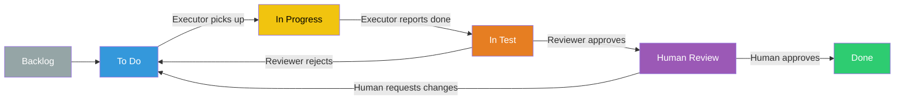

# notion-agent-hive

**Your AI coding assistant forgets everything between sessions. Notion doesn't.**

## Why this exists

Two things kept annoying me when working with AI coding agents:

**Sessions die at the worst time.** You're mid-feature on Claude Code, rate limit hits, "come back in three hours." There's no clean way to say "continue this on OpenCode." So you learn to ask it to write the plan down in markdown first, double-check the lists, keep a paper trail. It works, until you forget to ask, and now the context is just gone.

**You lose track of what actually happened.** You ask the agent to build something. There's back and forth, scope tweaks, small decisions along the way. Eventually it says "done!", gives you a five-item checklist, and behind it sits 200k tokens of internal thinking you're never going to scroll through. You don't quite remember everything that was discussed. You're not sure if something got dropped.

## What this does

It uses a **Notion kanban board as persistent memory** for the whole workflow. Every feature gets a Notion page with the full plan, all decisions, and the reasoning behind them, plus an inline kanban board where each task is a detailed ticket. The board lives outside any single session, so it's always there when you come back.

Why Notion specifically:

- **Picking up where you left off is trivial.** Any agent, in any session, in any tool, can read the ticket and keep going. The context isn't in chat history, it's in the ticket
- **You can actually review what happened.** Scroll the feature page to see what was planned, what was decided, and why. No digging through conversation logs
- **Link to the rest of your stuff.** Tickets can reference your existing Notion docs, specs, design files, whatever. Everything stays connected instead of living in isolated chat threads

## How It Works

Three specialized agents coordinate through a shared Notion board:

| Agent        | Role                                                                                                                                        |
| ------------ | ------------------------------------------------------------------------------------------------------------------------------------------- |
| **Thinker**  | Plans features, breaks work into tasks, makes product/architecture decisions. Creates the Notion board and populates detailed task tickets. |
| **Executor** | Implements code based on task specifications. Follows the ticket contract exactly, no guessing, no redesigning.                             |
| **Reviewer** | Verifies implementations against acceptance criteria. Gates tasks for human review before they can be marked done.                          |

### Ticket Lifecycle



**Key rule:** No agent can mark a task as Done. Only you can. The human always has final say.

A task can also be moved to **Needs Human Input** at any point when a decision requires your judgment. The agent won't guess.

## What a Task Ticket Looks Like

Each ticket is a self-contained Notion page with:

- **Objective**: what to implement and why
- **Background & context**: feature overview, architecture decisions, codebase conventions
- **Affected files & modules**: specific paths and symbols to touch
- **Technical approach**: numbered implementation plan with concrete references
- **Acceptance criteria**: binary pass/fail conditions
- **Validation commands**: exact commands to run and expected outcomes

The ticket is written so that any agent, with zero prior context, can pick it up and execute it. No chat history needed. No re-explaining.

## Getting Started

### Prerequisites

- A Notion workspace with an [integration/API token](https://www.notion.so/my-integrations)
- The Notion MCP server configured in your CLI tool
- One of the supported CLI tools (see Installation below)

### Installation

This repo provides agent definitions for multiple CLI tools:

- **Claude Code**: see [`.claude/INSTALL.md`](.claude/INSTALL.md)
- **OpenCode**: see [`.opencode/INSTALL.md`](.opencode/INSTALL.md)

### Usage

1. Start a conversation with the **Thinker** agent
2. Describe the feature you want to build
3. The Thinker will ask clarifying questions, explore your codebase, then create a Notion feature page with a full plan and task board
4. Say **"execute"** and the Thinker will dispatch tasks to the Executor, run them through the Reviewer, and surface completed work for your review
5. Review tasks in the **Human Review** column and move them to **Done**, or send them back with comments

You can close your session at any point. When you come back, even in a different tool, just point the Thinker at the same Notion board and pick up where you left off.

---

<details>
<summary><strong>Technical Details</strong></summary>

### Repository Structure

```
notion-agent-hive/
├── agents/                     # Source-of-truth agent templates
│   ├── notion-thinker.md
│   ├── notion-executor.md
│   └── notion-reviewer.md
├── scripts/                    # Platform-specific generators
│   ├── generate-claude-agents.ts
│   └── generate-opencode-agents.ts
├── .claude/                    # Generated Claude CLI agents
└── .opencode/                  # Generated OpenCode agents
```

### Source-of-Truth Architecture

Agent definitions use a generator-based workflow. The markdown body (behavior and instructions) is shared across platforms — only the YAML frontmatter differs per CLI tool.

| Layer                | Purpose                    | Location                 |
| -------------------- | -------------------------- | ------------------------ |
| Shared bodies        | Common agent instructions  | `agents/*.md`            |
| Platform frontmatter | CLI-specific configuration | `scripts/generate-*.ts`  |
| Generated outputs    | Installable artifacts      | `.claude/`, `.opencode/` |

### Development

```bash
npm run generate          # Regenerate all platform outputs
npm test                  # Run tests
```

### MCP Requirements

Only the **Notion MCP server** is required. No other MCP servers are mandatory for core functionality.

</details>
