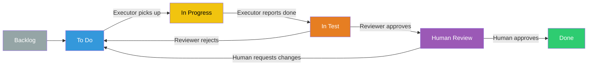

# notion-agent-hive

**Persistent memory for AI coding sessions using Notion.**

## Why this exists

Two, ahem, persistent problems with AI coding agents:

**Sessions die at the worst time.** You're mid-feature when rate limits hit or sessions expire. There's no clean way to continue on another platform. You learn to ask agents to write plans in markdown first, but it's easy to forget - and then the context is gone.

**You lose track of what actually happened.** When working on larger features that take time, you often switch between your agent and other tasks. Coming back later, it's hard to trace what happened and what the agent was working on. You get a "done!" checklist but lose the 200k tokens of reasoning behind it, leaving you wondering what was actually discussed and implemented.

**Limited task horizon.** Most AI coding sessions work best for small, contained tasks. When you want to tackle more ambitious, long-running features that span multiple sessions or days, you're left managing context manually - if you can at all.

## What this does

Uses **Notion kanban boards as persistent memory** for your entire workflow. Every feature gets:

- A dedicated Notion page with the full plan, decisions, and reasoning
- An inline kanban board with detailed task tickets
- Context that persists across sessions and tools

Why Notion specifically:

- **You might already be using it at work** - You can easily link the wider context, specs, or designs to the notion agent
- **Pick up where you left off instantly** - Any agent can read tickets and continue, no chat history needed
- **Review what actually happened** - See plans, decisions, and reasoning without digging through conversation logs

## How It Works

A coordinator manages three specialized subagents through a shared Notion board:

| Agent           | Role                                                                                                                                                                                 |
| --------------- | ------------------------------------------------------------------------------------------------------------------------------------------------------------------------------------ |
| **Coordinator** | Entry point. Manages the Notion board, creates feature pages and task tickets, dispatches subagents, and handles status transitions.                                                 |
| **Thinker**     | Deep research and investigation. Interrogates users, explores the codebase, decomposes features into tasks. Returns structured reports to the coordinator. Never modifies the board. |
| **Executor**    | Implements code for the specific ticket assigned by the Coordinator. Writes findings/work summaries on that ticket, then reports back; does not route itself to other tasks.         |
| **Reviewer**    | Verifies implementations against acceptance criteria. Gates tasks for human review before they can be marked done.                                                                   |

### Ticket Lifecycle



**Key rule:** No agent can mark a task as Done. Only you can. The human always has final say.

A task can also be moved to **Needs Human Input** at any point when a decision requires your judgment. The agent won't guess.

## Installation

### Quick Start

```bash
bunx @tesselate-digital/notion-agent-hive install
```

This command:

1. Adds `@tesselate-digital/notion-agent-hive` to the `plugin` array in `~/.config/opencode/opencode.json`
2. Creates a `~/.config/opencode/notion-agent-hive.json` starter config

### Prerequisites

- [OpenCode](https://opencode.ai) installed
- A Notion workspace with an [integration/API token](https://www.notion.so/my-integrations)
- The [Notion MCP server](https://github.com/makenotion/notion-mcp-server) configured in OpenCode

### Local Development

If you're developing from this repo instead of installing a published npm package, use a local plugin file.

OpenCode auto-loads `.ts` plugin files from `~/.config/opencode/plugins/` (or `$OPENCODE_CONFIG_DIR/plugins` / `$XDG_CONFIG_HOME/opencode/plugins` if you use those).

1. Build the plugin bundle:

```bash
bun install
bun build src/index.ts --outdir dist --target bun --format esm
```

2. Create `~/.config/opencode/plugins/notion-agent-hive.ts`:

```ts
import { NotionAgentHivePlugin } from "/absolute/path/to/notion-agent-hive/dist/index.js";

export { NotionAgentHivePlugin };
```

3. Create `~/.config/opencode/notion-agent-hive.json` to choose models for each internal agent:

```json
{
  "agents": {
    "coordinator": { "model": "openai/gpt-5.2" },
    "thinker": { "model": "openai/gpt-5.4", "variant": "xhigh" },
    "executor": { "model": "kimi-for-coding/k2p5" },
    "reviewer": { "model": "openai/gpt-5.4", "variant": "xhigh" }
  },
  "fallback": {
    "enabled": true,
    "chains": {}
  }
}
```

4. Configure your Notion MCP server in `~/.config/opencode/opencode.json` if you haven't already:

```json
{
  "mcp": {
    "notion": {
      "type": "remote",
      "url": "https://mcp.notion.com/mcp"
    }
  }
}
```

5. Restart OpenCode.
6. Start a session with the `notion agent hive` agent.

When you change plugin source, rebuild `dist/index.js` so OpenCode picks up the new code.

### Published Package

```bash
bunx @tesselate-digital/notion-agent-hive install
```

This command:

1. Adds `@tesselate-digital/notion-agent-hive` to the `plugin` array in `~/.config/opencode/opencode.json` (or `$OPENCODE_CONFIG_DIR/opencode.json` / `$XDG_CONFIG_HOME/opencode/opencode.json`)
2. Creates a `~/.config/opencode/notion-agent-hive.json` starter config (or the matching `$OPENCODE_CONFIG_DIR` / `$XGD_CONFIG_HOME` location)

If you want per-project overrides, create `notion-agent-hive.json` in the project root manually.

Then configure your Notion MCP server in `~/.config/opencode/opencode.json` if you haven't already:

```json
{
  "mcp": {
    "notion": {
      "type": "npx",
      "command": "npx",
      "args": ["-y", "@notionhq/notion-mcp-server"],
      "env": {
        "OPENAPI_MCP_HEADERS": "{\"Authorization\": \"Bearer YOUR_NOTION_TOKEN\"}"
      }
    }
  }
}
```

### Configuring Models

There are two places to configure models, merged at startup:

| Location                                    | Scope                 | Use for                       |
| ------------------------------------------- | --------------------- | ----------------------------- |
| `~/.config/opencode/notion-agent-hive.json` | Global (all projects) | Your personal default models  |
| `notion-agent-hive.json` in project root    | Per-project           | Overrides for a specific repo |

Project config takes precedence. Agent keys are merged individually — setting `thinker` in the project config does not wipe out `executor` from your global config.

Restart OpenCode for changes to take effect.

---

Model IDs use the `provider/model-name` format that OpenCode uses — any provider configured in your OpenCode setup works here.

The public agent name is `notion agent hive`, but the model config key is still `coordinator`.

The `$schema` path depends on how you installed the plugin. For local development or global config, it's simplest to omit `$schema`.

```json
{
  "agents": {
    "coordinator": { "model": "openai/gpt-5.2" },
    "thinker": { "model": "openai/gpt-5.4", "variant": "xhigh" },
    "executor": { "model": "kimi-for-coding/k2p5" },
    "reviewer": { "model": "openai/gpt-5.4", "variant": "xhigh" }
  }
}
```

Each agent has a distinct role, so you can tune them independently:

| Agent           | Role                                 | Suggested model profile                                     |
| --------------- | ------------------------------------ | ----------------------------------------------------------- |
| **coordinator** | Dispatches agents, moves tickets     | Fast and cheap — it mostly routes, not thinks               |
| **thinker**     | Deep research, feature decomposition | Most capable model you have — this is where quality matters |
| **executor**    | Code implementation                  | Balanced — good at coding tasks                             |
| **reviewer**    | QA verification, criteria checking   | Same tier as executor                                       |

#### Variants

Some providers support model-specific variants such as `"xhigh"` or `"max"`:

```json
{
  "agents": {
    "thinker": { "model": "openai/gpt-5.4", "variant": "xhigh" },
    "reviewer": { "model": "anthropic/claude-opus-4", "variant": "max" }
  }
}
```

#### Fallback chains

Define ordered fallback models per agent. If the primary model hits a rate limit mid-session, the plugin automatically switches to the next in the chain:

```json
{
  "agents": {
    "thinker": { "model": "openai/gpt-5.4" }
  },
  "fallback": {
    "enabled": true,
    "chains": {
      "thinker": ["google/gemini-2.5-pro", "anthropic/claude-opus-4"]
    }
  }
}
```

You can also pass the full chain directly as the `model` value — the first entry is used at startup, the rest are fallbacks:

```json
{
  "agents": {
    "thinker": {
      "model": [
        "openai/gpt-5.4",
        "google/gemini-2.5-pro",
        "anthropic/claude-opus-4"
      ]
    }
  }
}
```

### Usage

1. Open OpenCode and start a session with the **notion agent hive** agent
2. Describe the feature you want to build
3. The Coordinator dispatches the Thinker, who interrogates you, explores your codebase, and creates the Notion feature page + task board
4. Say **"execute"** and the Coordinator dispatches tasks to the Executor, runs them through the Reviewer, and surfaces completed work for your review
5. Review tasks in the **Human Review** column and move them to **Done**, or send them back with comments

You can close your session at any point. When you come back, point the Coordinator at the same Notion board and pick up where you left off.

---

<details>
<summary><strong>Technical Details</strong></summary>

### Repository Structure

```
notion-agent-hive/
├── src/
│   ├── agents/
│   │   ├── types.ts          # AgentDefinition + AgentConfig interfaces
│   │   ├── coordinator.ts    # notion agent hive agent factory
│   │   ├── thinker.ts        # notion-thinker agent factory
│   │   ├── executor.ts       # notion-executor agent factory
│   │   └── reviewer.ts       # notion-reviewer agent factory
│   ├── cli/
│   │   ├── index.ts          # CLI entry point
│   │   └── install.ts        # install command
│   ├── config.ts             # Config loading + Zod validation
│   ├── fallback.ts           # Runtime model fallback manager
│   └── index.ts              # Plugin entry point + public API
├── schema.json               # JSON Schema for notion-agent-hive.json
├── biome.json
├── tsconfig.json
└── package.json
```

### MCP Requirements

Only the **Notion MCP server** is required. No other MCP servers are mandatory for core functionality.

</details>
