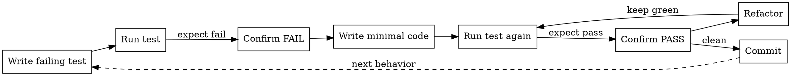

## TDD Workflow

<HARD-GATE>
You MUST follow red-green-refactor for all code changes. No exceptions for "simple" or "trivial" changes.
</HARD-GATE>

### The Cycle

1. **RED**: Write a test that defines the expected behavior. The test MUST fail.
2. **RUN**: Execute the test. Confirm it fails for the RIGHT reason (not a syntax error).
3. **GREEN**: Write the MINIMAL code to make the test pass. No more.
4. **RUN**: Execute the test. Confirm it passes.
5. **REFACTOR**: Clean up the code while keeping tests green.
6. **COMMIT**: Small, focused commit for this cycle.

### Anti-Patterns

- **Writing implementation before tests**: You lose the safety net. The test might pass for the wrong reason.
- **Writing multiple tests before implementing**: You lose focus. One test, one behavior.
- **Writing more code than needed to pass**: YAGNI. The next test will drive the next behavior.
- **Skipping the "confirm fail" step**: If the test passes before implementation, it's not testing anything useful.
